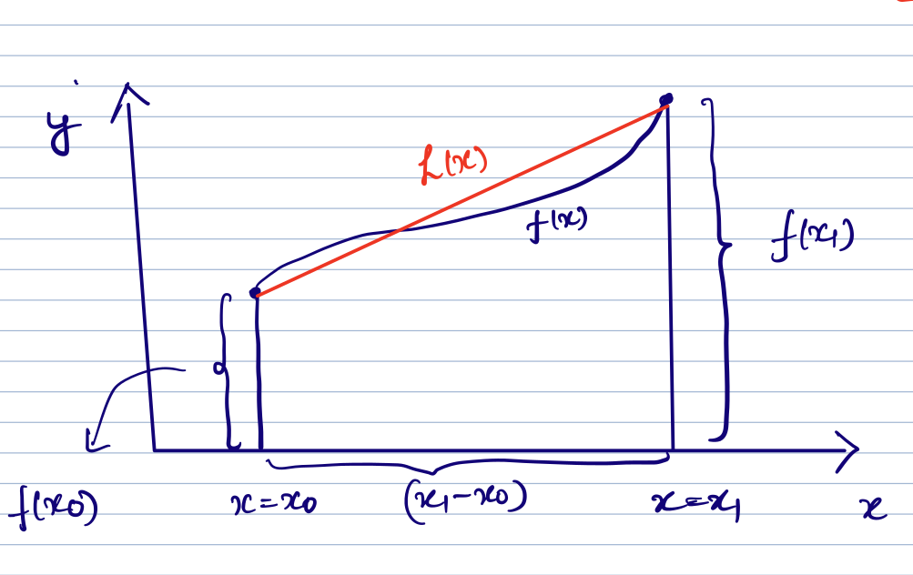
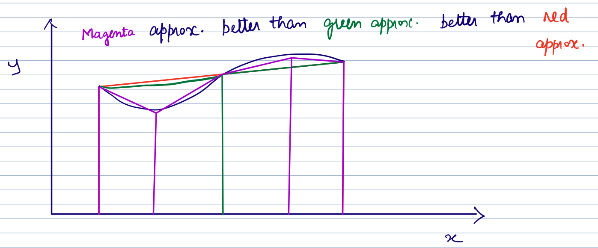

# Numerical Integartion

While, integrating functions is possible and convenient when done analytically, it is not always possible. There are situations where the function is too complex for doing an analytical integration is difficult or impossible. Further, the function that needs to be integrated may not be a continuous function to begin with, which will preclude analytical integration.
The key idea in performing numerical integration is the use of numerical quadrature.

$$
\displaystyle
I(x) = \displaystyle\int_{x_0}^{x_1}{f(x) dx} = \displaystyle\sum_{i = 0}^{n}{ w_i f(x_i) }
$$

Here, $w_i$ are the weights associated with a discrete point $x_i$.

$f(x_i)$ are the function values at the discrete point $x_i$.

Becuase the integral value, $I(x)$, depends on function values evaluated at some points $x_i  \in (x_0, x_1)$, we can use the concepts of interpolation to get
explicit expressions for the approximate integral, as follows:

$$
\displaystyle
I(x) = \displaystyle\int_{x_0}^{x_1}{f(x) dx} = \displaystyle\int_{x_0}^{x_1}{L(x) dx}
$$

Consider the piecewise linear Lagrange interpolation between $x_0$ and $x_1$ as follows:

$$
\displaystyle
L(x) = \frac{(x-x_1)}{(x_0 - x_1)} f(x_0) + \frac{(x-x_0)}{(x_1 - x_0)} f(x_1)
$$

$$
I(x) = \displaystyle\int_{x_0}^{x_1}{f(x) dx} = \displaystyle\int_{x_0}^{x_1} \frac{(x-x_1)}{(x_0 - x_1)} f(x_0) + \displaystyle\int_{x_0}^{x_1} \frac{(x-x_0)}{(x_1 - x_0)} f(x_1)
$$


$$
\displaystyle
I(x) =  \frac{f(x_0)}{(x_0 - x_1)}  \left.\left( \frac{x^2}{2} - x_1 x \right) \right|_{x_0}^{x_1} +
        \frac{ f(x_1)}{(x_1 - x_0)} \left.\left( \frac{x^2}{2} - x_0 x \right) \right|_{x_0}^{x_1} +
$$


$$
\displaystyle
 = \frac{ f(x_0)}{(x_0 - x_1)} \left( \frac{{x_1}^2}{2} - \frac{{x_0}^2}{2} - {x_1}^2 + x_1 x_0 \right)  +
   \frac{ f(x_1)}{(x_1 - x_0)} \left( \frac{{x_1}^2}{2} - \frac{{x_0}^2}{2} + {x_0}^2 - x_1 x_0 \right)  +
$$


$$
\displaystyle
 = \frac{ f(x_0)}{(x_0 - x_1)} \left( -\frac{{x_1}^2}{2} - \frac{{x_0}^2}{2} + x_1 x_0 \right)  +
   \frac{ f(x_1)}{(x_1 - x_0)} \left( \frac{{x_1}^2}{2} + \frac{{x_0}^2}{2}  - x_1 x_0 \right)  +
$$


$$
\displaystyle
I(x) = \frac{ -f(x_0)}{2(x_0 - x_1)} \left( x_0  - x_1 \right)^2  +
       \frac{  f(x_1)}{2(x_1 - x_0)} \left( x_1 - x_0 \right)^2
$$


$$
\displaystyle
	= \frac{(x_1 - x_0)}{2} f(x_0) + \frac{(x_1 - x_0)}{2} f(x_1)
$$


$$
\displaystyle
	= (x_1 - x_0) \frac{ f(x_0) + f(x_1)}{2}
$$

The expression we obtained in the last step above, is nothing but the area of the trapezium.




As one would expect with a linear interpolation, the trapezoidal rule gives exact results when integrating any polynomial of degree $1$ or lower.

```{admonition} Piecewise Quadratic Lagrange Interpolation !
:class: tip, dropdown
Simpson's Rule!

$$
 f(x) = L(x) = \frac{(x - x_1) (x - x_2)}{(x_0 - x_1) (x_0 - x_2)} f(x_0) +
      	        \frac{(x - x_0) (x - x_2)}{(x_1 - x_0) (x_1 - x_2)} f(x_1) + 	   
		\frac{(x - x_0) (x - x_1)}{(x_2 - x_0) (x_2 - x_0)} f(x_2) + 
$$

Simplifyling this will result in

$$
I(x) = \frac{h}{3} \left( f(x_0) + 4 f(x_1) + f(x_2) \right)
$$

where $h = (x_1 - x_0) = (x_2 - x_1)$

Simpson's rule is exact upto polynomials of degree 3 or lower. 


```

Note that we can subdivide a given integration interval into several sub-intervals and apply trapezoidal and Simpsons's rules over the sub-intervals to improve
approximation accuracy.


